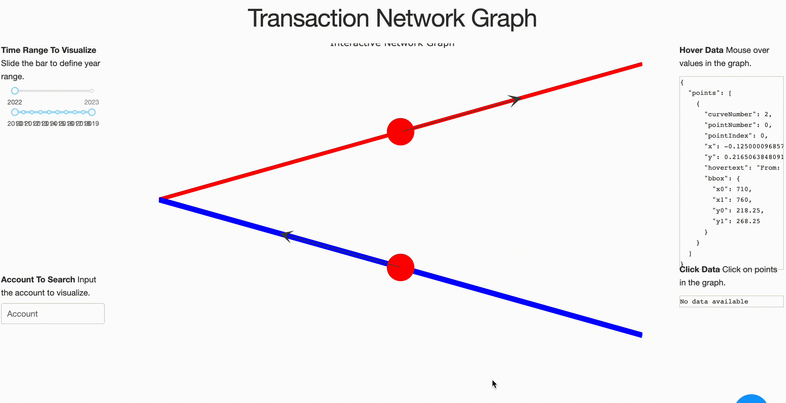

# GraphOS - Network Graph Visualization

GraphOS is a web-based network graph visualization tool built using Dash, a Python framework for building web applications. This application allows users to explore network graphs based on data with nodes and edges, and visualize the relationships between them.

## Features

- Network graph visualization: Displays a visual representation of the network graph with nodes and edges.
- Year range slider: Allows users to filter the data based on a specific year range.
- Account filter: Allows users to input an account name and filter the graph data accordingly.
- Time slider: Allows users to view the graph data for a specific time point.
- Hover and click data: Provides detailed information about nodes and edges when hovered or clicked on.
- Responsive design: Designed with CSS stylesheets to ensure a responsive and visually appealing user interface.

## Installation

1. Clone the repository:

- git clone https://github.com/yourusername/graphos.gitChange to the project directory:
- cd graphos
- Install the required dependencies:
- pip install -r requirements.txt

2. Run the application:
- python app.py

3. Open a web browser and go to http://127.0.0.1:8050/ to access the GraphOS web application.

## Usage
- Use the year range slider to filter the data based on a specific year range.
- Input an account name in the account filter to filter the graph data accordingly.
- Use the time slider to view the graph data for a specific time point.
- Hover over nodes or edges to view detailed information about them.
- Click on nodes or edges to view additional information.
## Contributing
- Contributions to GraphOS are welcome! If you would like to contribute, please follow these steps:
- Fork the repository.
- Create a new branch for your feature or bug fix.
- Make changes and commit them to your branch.
- Push your changes to your forked repository.
- Create a pull request with a detailed description of your changes.

## License
- GraphOS is released under the MIT License.

## Acknowledgements
- GraphOS was built using the following libraries:

- Dash: https://dash.plotly.com/
- NetworkX: https://networkx.github.io/
- Plotly: https://plotly.com/
- Pandas: https://pandas.pydata.org/

